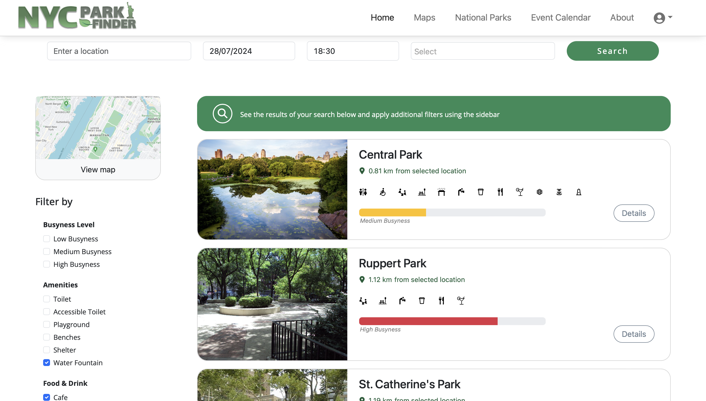
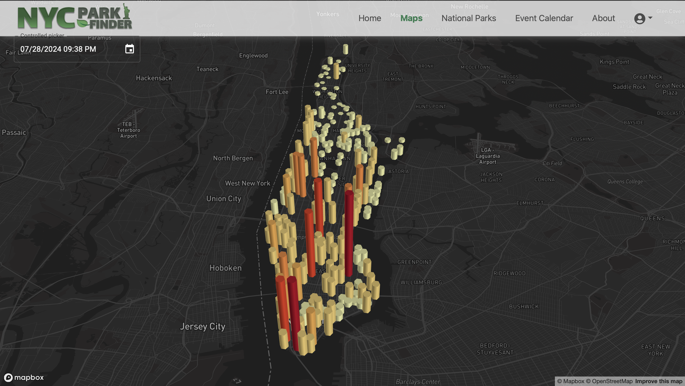
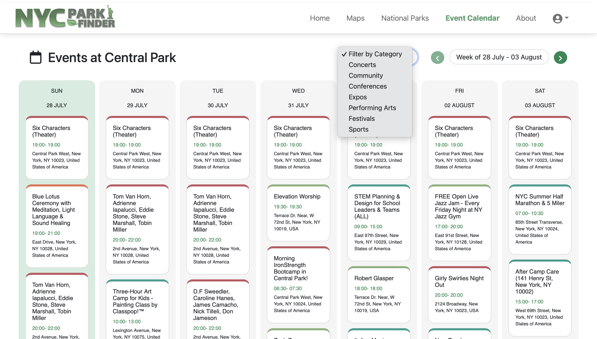
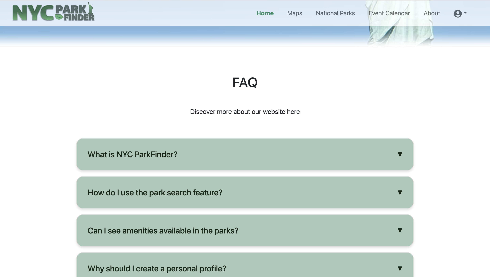
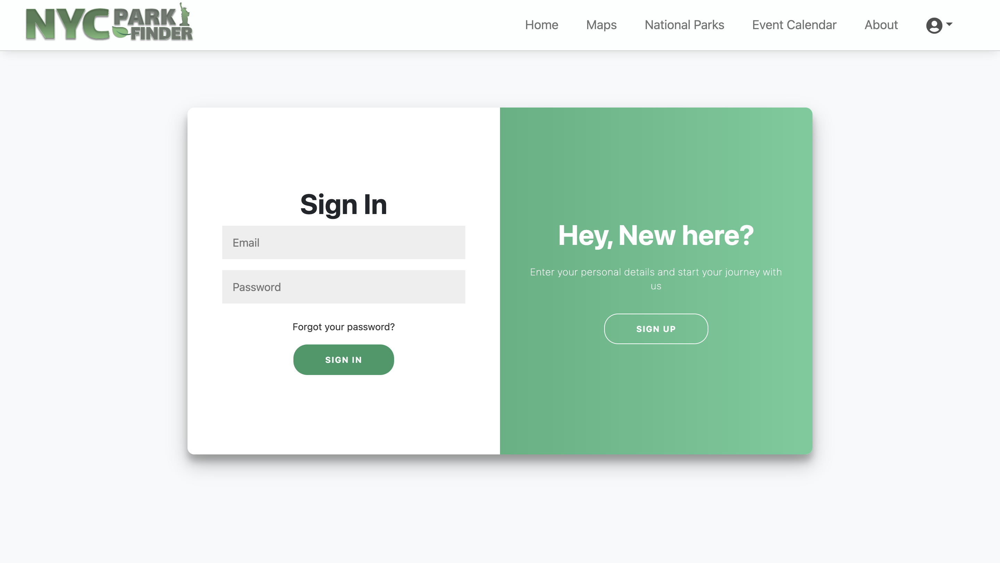
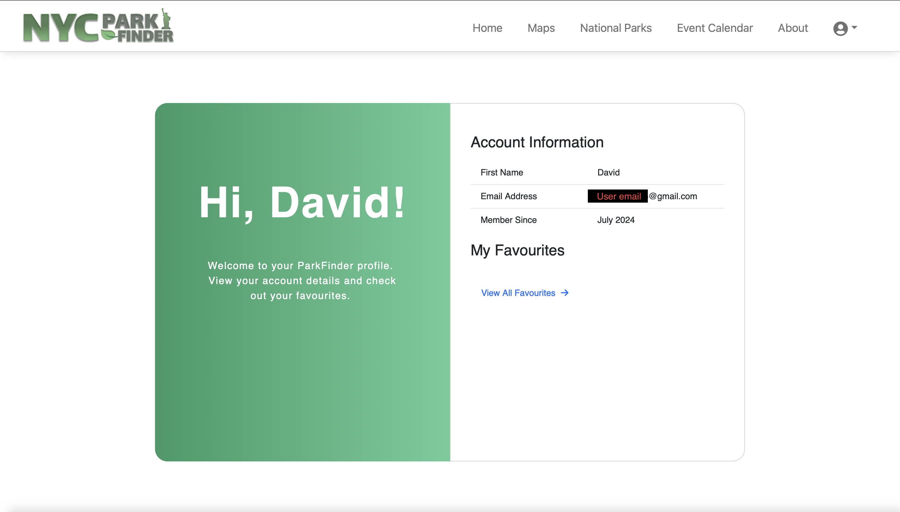

# UCD COMP47360 - Summer Research Practicum 
MSc Computer Science Conversion 2023-24 - Group #1
<br />

- This project has been developed using languages consisting of Java, Typescript, Javascript, HTML, and CSS.

<p align="center">
  
</p>

<br />

# NYC PARKFINDER

The following includes a breakdown of the main features of the application, displaying a total of nine screenshots of the webpages.

Instructions for running the navigating this repository and running the webpage are included in the beginning.

##### A list of contributors and their respective roles is included at the bottom.
-------------------------

## Installation
1. Clone the repository to your local machine:

```shell
$ git clone https://github.com/shalineraghupathy/comp47360
```

2. Navigate to the project directory:

```
$ cd 
```

3. Create a virtual environment and activate it (if applicable):

```

```

4. Install the required dependencies:

```
pip install -r requirements.txt
```

5. Start the development server
```
flask run 
```

6. Then open localhost:5000 in your browser to view the webpage

<br />


----------

## User Interface

#### 1. Homepage (opening screen) - [Home](parkfinder-client/src/components/parksearch)
<p align="center">
  
</p>
<br />

- This repository is for NYC ParkFinder, a web based application that allows users to explore parks, outdoor spaces, events and amenties that are avilable to them in Manhattan, New York City. 

- Users can plan their visit to a wide range of parks in the Manhattan area using the applications simplistic and intuitive interface.

<br />

#### 2. Park Search Bar (Homepage) - [Park Search](parkfinder-client/src/components/parksearch)
<p align="center">
  
</p>
<br />

- On the homepage, the user can begin their search by entering their current or desired location, along with a date, time and select from a range of ameities. Clicking the search button will display our 'Search Results' webpage, generating a number of recommendations for parks and green spaces that best suit the needs of the user.

#### 3. Search Results Page - [Results](parkfinder-client/src/components/results/)
<p align="center">
  
</p>
<br />

- A prediction for the level of busyness is displayed for each of the recommended parks. This particular feature assists users in making informed decisions, while enhancing overall experience. Historical data and machine learning model implementations are leveraged to achieve this. 

- Park information is displayed including distance from search input location, aswell as park amenities, and additional park info.

- Users can filter by busyness level, amenties, for hospitality businesses in the side panel.

- A map feature is also available on the upper left corner to allow users to visualise the recommended park locations in Manhattan.  

<br />

#### 4. Heatmap Page - [Maps](parkfinder-client/src/components/maps/)
<p align="center">
  
</p>
<br />

- Users can select the Maps tab in the Navigation bar at the top of the screen, rendering a heatmap on the screen. This allows for a date and time input in the upper left corner. The result displays figures across the map to indicate the level of busyness in an alternative manor. (Red indicates a higher level of busyness).

<br />

#### 5. National Park Finder Page - [National Parks](parkfinder-client/src/components/nationalparks/)
<p align="center">
  
</p>
<br />


- The application features a 'National Parks' page that allows users to explore and discover a number of national parks and monuments that are located in Manhattan and the greater state of New York.
-This page can be accessed from the nav bar and homepage.

- Users can navigate their way through the page using search filters, and display detailed cards that showcase information relating to each of the parks, and the amenties available at these locations. 

<br />

#### 6. Event Calendar Page - [Event Calendar](parkfinder-client/src/components/nationalparks/)
<p align="center">
  
</p>
<br />

- The 'Event Calendar' page allows users to discover various events taking place in Central Park, which is arguably the most well know outdoor park in NYC.

- A search filter is provided to tailor the results to specific event types. 

 - The calendar displays events across each week, and allows the user to view the schedule for weeks in advance of the current date, with the naviagtion arrows in the upper right corner.


<br />

#### 7. Information Section (homepage) - [About](parkfinder-client/src/components/home/MainContent.tsx)
<p align="center">
  
</p>
<br />

- For additional information about NYC Park Finder and the application's features, users can check out the FAQ section on the homepage, by scrolling down to the bottom, or clicking the 'About' tab in the nav bar.

<br />

#### 8. User Login and Sign-Up Page (NavBar Icon) - [Login/Sign-Up](parkfinder-client/src/components/signup/)
<p align="center">
  
</p>
<br />

- The application offers users the oppurtunity to create a login account, to allow them to save their favorite parks, creating a backlog of locations with their preferred amenties.

- Users can navigate their way to this page by clicking the profile icon on the right side of the Navbar.

- An email verification link will be sent to users when they sign up.

<br />

#### 9. User Profile Card (homepage) - [Profile Card](parkfinder-client/src/components/navbar/ProfileCard.tsx)
<p align="center">
  
</p>
<br />

- When users are logged in, a profile card is displayed.

- Users can click the options available in the card to see their 'Profile' page and details, or to show the 'Favourites' page with their favorited parks.

<br />

#### 9. User Profile Page - [Profile Page](parkfinder-client/src/components/signup/ProfilePage.tsx)
<p align="center">
  
</p>
<br />

- When the user navigates to their profile page, they are greeted, and provided with their account information that was entered when signing up. 

- A small selection from their list of favorited parks is also provided, allowing users to proceed to the additional 'Favorites' page (not shown), for a more comprehensive list of their favorite locations around Manhattan.


<br />
<br />

## Contributors
<br />

| Name                                                      | Role                 |
| --------------------------------------------------------- | -------------------- |
| [Laura Bell](https://github.com/sera-v)                   | Front-End Lead       |
| [Yanwen Yu](https://github.com/yanwennn)                  | Back-End Lead        |
| [Adi Bhattacharya](https://github.com/adibnow-cs)        | Data Lead            |
| [Shaline Raghupathy](https://github.com/shalineraghupathy)| Maintenance Lead     |
| [Ja Wei Lee](https://github.com/Jaweilee)                 | Coordination Lead    |
| [David Woods](https://github.com/DAVIDWOODS)              | Customer Lead        |


