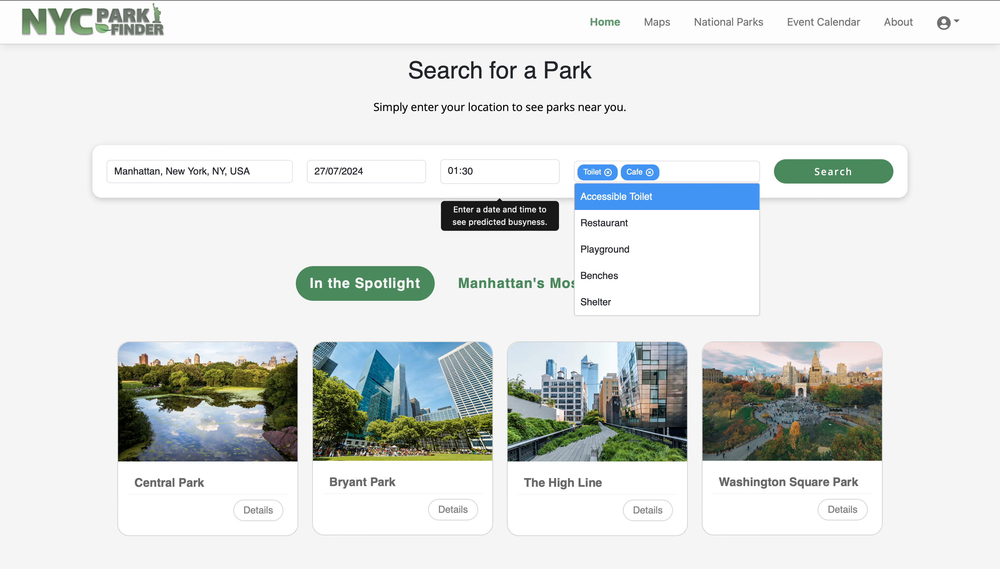
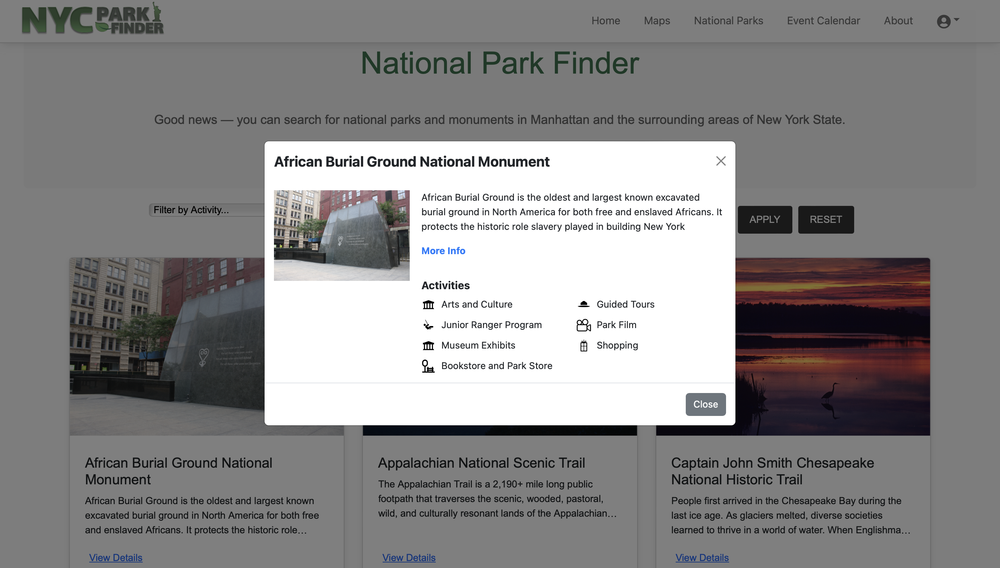

# UCD COMP47360 - Summer Research Practicum 
MSc Computer Science Conversion 2023-24 - Group #1
 

- This project has been developed using languages consisting of Java, Typescript, Javascript, HTML, and CSS.

## NYC PARKFINDER

  

 

- This repository is for NYC ParkFinder, a web based application that allows users to explore parks, outdoor spaces, events and amenties that are avilable to them in Manhattan, New York City. 

- Users can plan their visit to a wide range of parks in the Manhattan area using the applications simplistic and intuitive interface.

 

  

 

- Through entering a current or desired location, along with date, time and their choice of ameities, the application will navigate to an addition webpage to display a number of recommendations for parks and green spaces that best suit the needs of the user.

- A prediction for the level of busyness for each of the recommended parks will be displayed on screen. This particular feature allows to user to make informed decisions and enhances the overall experience, through the user of historical data and machine learning model implementations. 

 

  

 

- The application features a page that allows users to explore and discover a number of national parks and monuments that are located in Manhattan and the greater state of New York.
- Users can navigate their way through the page using search filters, and display detailed cards that showcase information relating to each of the parks, and the amenties available at these locations. 

## Contributors
 

| Name                                                      | Role                 |
| --------------------------------------------------------- | -------------------- |
| [Laura Bell](https://github.com/sera-v)                   | Front-End Lead       |
| [Yanwen Yu](https://github.com/yanwennn)                  | Back-End Lead        |
| [Adi Bhattacharya](https://github.com/adibnow-cs)        | Data Lead            |
| [Shaline Raghupathy](https://github.com/shalineraghupathy)| Maintenance Lead     |
| [Ja Wei Lee](https://github.com/Jaweilee)                 | Coordination Lead    |
| [David Woods](https://github.com/DAVIDWOODS)              | Customer Lead        |

